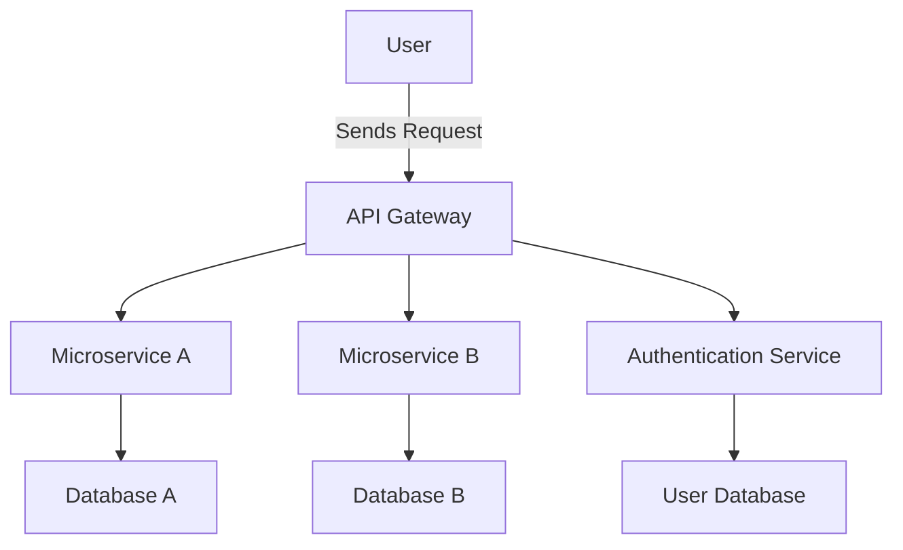

```mermaid

    graph TD;
        A[User] -->|Sends Request| B[API Gateway];
        B --> C[Microservice A];
        B --> D[Microservice B];
        C --> E[Database A];
        D --> F[Database B];
        B --> G[Authentication Service];
        G --> H[User Database];

```